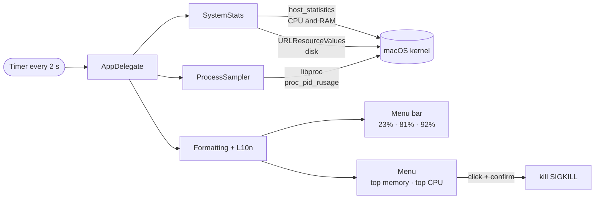

<p align="center">
  
</p>

<h1 align="center">SystemMonitor</h1>

<p align="center"><b>English</b> · <a href="README.pt-BR.md">Português</a></p>

<p align="center">
  Real-time CPU, RAM and disk usage in your Mac menu bar.<br>
  Lightweight and native, with no dependencies: a sub-1 MB app written in pure Swift.
</p>

<p align="center">
  
  
  
  
</p>

<p align="center">
  
</p>

## Features

- **CPU, RAM and disk in the menu bar**, refreshed every 2 seconds, with native SF Symbols icons that follow light and dark mode.
- **Alert colors:** a value turns yellow at 75% and red at 90%.
- **Top 8 apps by memory and top 5 by CPU**, with the same numbers as Activity Monitor.
- **Processes grouped by app, with the app's icon:** helper processes of Chrome, Slack, Teams, and even Safari's web pages, add up under the app that launched them.
- **One-click force quit**, always with a confirmation. System processes are listed but can't be quit.
- **Open at Login**, toggled right from the menu.
- **English or Portuguese:** English by default; switch in **Language → Português (Brasil)**.
- **Unobtrusive:** no Dock icon and a tiny CPU footprint.

## Installation

Requires macOS 14 (Sonoma) or later and the Xcode Command Line Tools (`xcode-select --install`).

```sh
git clone https://github.com/xfelipealves/SystemMonitor.git
cd SystemMonitor
./build.sh install
```

`install` builds the app, copies it to `/Applications` and opens it. To only build, run `./build.sh`; the app lands in `build/SystemMonitor.app`.

> The app is signed locally (ad-hoc), not by Apple. Built on your own Mac, it opens without warnings.

## How it works



| Indicator | Source | Matches |
|---|---|---|
| CPU | `host_statistics(HOST_CPU_LOAD_INFO)`, delta between two readings | Activity Monitor → CPU |
| RAM | app memory + wired + compressed (`host_statistics64`) | Activity Monitor → Memory Used |
| Disk | `/` volume, purgeable space counted as free | Finder → Get Info |
| Processes | `proc_pid_rusage` (`ri_phys_footprint` and CPU time) | Activity Monitor → Memory and % CPU columns |

Processes are grouped by the outermost `.app` bundle in their path. XPC services, such as WebKit web pages, are assigned to the app responsible for them.

### Project layout

```
Sources/
├── main.swift            starts the app without a Dock icon
├── AppDelegate.swift     menu bar item, menu, timer and actions
├── SystemStats.swift     total CPU, RAM and disk usage
├── ProcessSampler.swift  per-process memory and CPU, grouped by app
├── Formatting.swift      text, icons and alert colors
└── Localization.swift    English and Portuguese strings
Resources/                Info.plist and app icon
scripts/                  icon and illustration generators
```

## Limitations

- Only your user's processes are listed. Other users' and system (root) processes can't be read without admin privileges.
- Force quitting a group quits every process in it. For example, quitting `node` ends every running `node` process.
- On a crowded menu bar, the notch may hide the indicator.

## Development

```sh
./build.sh                      # build into build/
./scripts/make-icns.sh          # regenerate the icon from scripts/make-icon.swift
python3 scripts/make-preview.py # regenerate docs/preview.svg
```

## License

[MIT](LICENSE) © 2026 Felipe Alves
