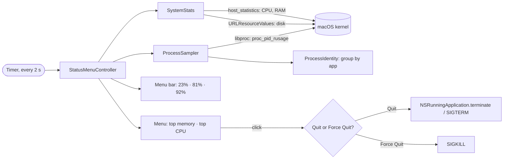

<p align="center">
  
</p>

<h1 align="center">SystemMonitor</h1>

<p align="center"><b>English</b> · <a href="README.pt-BR.md">Português</a></p>

<p align="center">
  Real-time CPU, RAM and disk usage in your Mac menu bar.<br>
  Native and lightweight: a sub-1 MB app written in Swift, with no dependencies.
</p>

<p align="center">
  <a href="https://github.com/xfelipealves/SystemMonitor/releases/latest"></a>
  <a href="https://github.com/xfelipealves/SystemMonitor/actions/workflows/ci.yml"></a>
  
  
  
</p>

<p align="center">
  
</p>

<p align="center"><sub>Illustrations are simulated; your apps and numbers will differ.</sub></p>

## Features

- **CPU, RAM and disk in the menu bar**, refreshed every 2 seconds.
- **Alert colors:** a value turns yellow at 75% and red at 90%. Icons follow light and dark mode.
- **Top 8 apps by memory and top 5 by CPU**, with the same numbers as Activity Monitor.
- **Grouped by app, with the app's icon.** Helper processes and web pages add up under the app that opened them. For example, all 20 Safari processes appear as one "Safari" line.
- **Quit or Force Quit with one click.** Quit closes the app normally, like ⌘Q, so it can ask you to save. Force Quit ends it immediately.
- **Open at Login**, toggled from the menu.
- **English or Portuguese**, switched under **Language**.
- **Unobtrusive:** no Dock icon, about 30 MB of memory and a tiny CPU footprint.

<p align="center">
  
</p>

<p align="center">
  
</p>

## Installation

Requires macOS 14 (Sonoma) or later, on Apple Silicon or Intel.

### Option 1: one-line installer (recommended)

Paste into Terminal:

```sh
curl -fsSL https://raw.githubusercontent.com/xfelipealves/SystemMonitor/main/install.sh | sh
```

It downloads the latest release, puts it in `/Applications` and opens it. Because it downloads with `curl` instead of a browser, macOS opens the app without a security warning. [Read the script](install.sh) before running it, if you like.

### Option 2: download the app

1. Download **SystemMonitor.zip** from the [latest release](https://github.com/xfelipealves/SystemMonitor/releases/latest).
2. Unzip it and drag **SystemMonitor.app** to **Applications**.
3. Open it. macOS will block it the first time (see below).

### Option 3: build from source

Requires the Xcode Command Line Tools (`xcode-select --install`).

```sh
git clone https://github.com/xfelipealves/SystemMonitor.git
cd SystemMonitor
./build.sh install
```

### Why macOS warns about the app

SystemMonitor is free and is not signed with a paid Apple Developer ID. macOS therefore blocks any copy downloaded through a browser, with a message like *"Apple could not verify SystemMonitor is free of malware"*. Options 1 and 3 avoid this. If you used option 2, allow it once using either method:

- **Through System Settings:** open the app once and close the warning. Then go to **System Settings → Privacy & Security**, scroll down and click **Open Anyway** next to SystemMonitor.
- **Through Terminal:**

  ```sh
  xattr -dr com.apple.quarantine /Applications/SystemMonitor.app
  ```

The source code is all here, and every release is built from it by [GitHub Actions](.github/workflows/release.yml).

### Uninstall

Choose **Quit** in the menu, then run:

```sh
rm -rf /Applications/SystemMonitor.app
defaults delete com.xfelipealves.systemmonitor 2>/dev/null
```

If you turned on Open at Login, turn it off before deleting the app.

## How it works



| Indicator | Source | Matches |
|---|---|---|
| CPU | `host_statistics(HOST_CPU_LOAD_INFO)`, difference between two readings | Activity Monitor → CPU |
| RAM | App memory + wired + compressed (`host_statistics64`) | Activity Monitor → Memory Used |
| Disk | Startup volume, purgeable space counted as free | Finder → Get Info |
| Per app | `proc_pid_rusage`: `ri_phys_footprint` and CPU time | Activity Monitor → Memory and % CPU |

**Grouping rule:** a process belongs to the outermost `.app` bundle in its path, so Chrome's helpers count as Chrome. An XPC service, such as a WebKit web page, belongs to the app responsible for it. Everything else is grouped by binary name.

## Project layout

```
Sources/SystemMonitor/
├── App/
│   ├── main.swift                  starts the app without a Dock icon
│   ├── AppDelegate.swift           app lifecycle
│   ├── StatusMenuController.swift  menu bar item, menu and timer
│   ├── Alerts.swift                quit and error dialogs
│   └── LaunchAtLogin.swift         Open at Login (SMAppService)
├── Metrics/
│   └── SystemStats.swift           total CPU, RAM and disk usage
├── Processes/
│   ├── LibProc.swift               libproc wrappers
│   ├── ProcessIdentity.swift       which app a process belongs to
│   ├── ProcessSampler.swift        memory and CPU per app
│   └── ProcessTerminator.swift     Quit and Force Quit
└── Support/
    ├── Formatting.swift            numbers, colors and menu titles
    └── Localization.swift          English and Portuguese strings
Tests/SystemMonitorTests/           unit tests
Resources/                          Info.plist and app icon
scripts/                            icon and illustration generators
```

## Development

```sh
swift build                             # debug build
swift test                              # unit tests (needs Xcode, not only the Command Line Tools)
./build.sh                              # universal SystemMonitor.app in build/
./build.sh install                      # build, copy to /Applications and open
./scripts/make-icns.sh                  # regenerate the app icon
python3 scripts/make-illustrations.py   # regenerate the images in docs/
```

### Releasing a new version

1. Update `CFBundleShortVersionString` in `Resources/Info.plist` and add a section to `CHANGELOG.md`.
2. Tag and push:

   ```sh
   git tag v1.2.0 && git push origin v1.2.0
   ```

GitHub Actions runs the tests, builds the universal app and publishes the release, using the changelog section as release notes.

## Limitations

- Only your own processes are listed. Reading other users' and system (root) processes requires admin privileges.
- Quitting a group affects all its processes. For example, quitting `node` ends every running `node` process.
- On a crowded menu bar, the notch may hide the indicator.

## License

[MIT](LICENSE) © 2026 Felipe Alves
