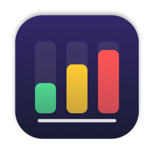
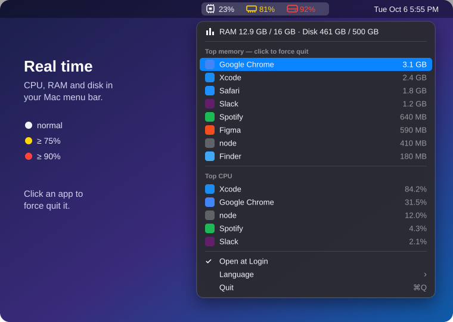
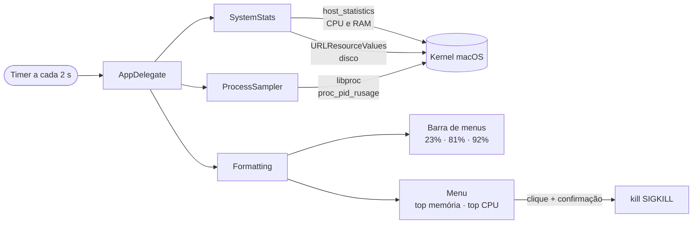

<p align="center">
  
</p>

<h1 align="center">SystemMonitor</h1>

<p align="center"><a href="README.md">English</a> · <b>Português</b></p>

<p align="center">
  CPU, RAM e disco em tempo real na barra de menus do Mac.<br>
  Leve, nativo, sem dependências: um app de menos de 1 MB escrito em Swift puro.
</p>

<p align="center">
  
  
  
  
</p>

<p align="center">
  
</p>

## Recursos

- **CPU, RAM e disco na barra de menus**, atualizados a cada 2 segundos, com ícones nativos (SF Symbols) que seguem o modo claro e o escuro.
- **Cores de alerta:** o número fica amarelo a partir de 75% e vermelho a partir de 90%.
- **Os 8 apps que mais usam memória e os 5 que mais usam CPU**, com os mesmos números do Monitor de Atividade.
- **Processos agrupados por app, com o ícone do app:** os processos auxiliares do Chrome, Slack e Teams, e até as páginas web do Safari, aparecem somados no app que os abriu.
- **Forçar encerramento com um clique**, sempre com confirmação. Processos do sistema aparecem, mas não podem ser encerrados.
- **Abrir ao iniciar o Mac**, ligado e desligado direto pelo menu.
- **Inglês ou português:** o app abre em inglês; troque em **Language → Português (Brasil)**.
- **Discreto:** não aparece no Dock e usa uma fração mínima de CPU.

## Instalação

Requer macOS 14 (Sonoma) ou mais recente e as Command Line Tools do Xcode (`xcode-select --install`).

```sh
git clone https://github.com/xfelipealves/SystemMonitor.git
cd SystemMonitor
./build.sh install
```

O `install` compila o app, copia para `/Applications` e abre. Para só compilar, rode `./build.sh`; o app fica em `build/SystemMonitor.app`.

> O app é assinado localmente (ad-hoc), não pela Apple. Compilando na sua máquina, o macOS abre sem avisos.

## Como funciona



| Indicador | Origem | Mesmo valor que |
|---|---|---|
| CPU | `host_statistics(HOST_CPU_LOAD_INFO)`, diferença entre duas leituras | Monitor de Atividade → CPU |
| RAM | memória de apps + fixa + comprimida (`host_statistics64`) | Monitor de Atividade → Memória Usada |
| Disco | volume `/`, espaço liberável conta como livre | Finder → Obter Informações |
| Processos | `proc_pid_rusage` (`ri_phys_footprint` e tempo de CPU) | Monitor de Atividade → colunas Memória e % CPU |

### Estrutura

```
Sources/
├── main.swift            inicia o app sem ícone no Dock
├── AppDelegate.swift     barra de menus, menu, timer e ações
├── SystemStats.swift     uso total de CPU, RAM e disco
├── ProcessSampler.swift  memória e CPU por processo, agrupados por app
├── Formatting.swift      textos, ícones e cores de alerta
└── Localization.swift    textos em inglês e português
Resources/                Info.plist e ícone do app
scripts/                  geradores do ícone e da ilustração
```

## Limitações

- Só aparecem os processos do seu usuário. Processos de outros usuários e do sistema (root) não podem ser lidos sem privilégios de administrador.
- Forçar o encerramento de um grupo encerra todos os processos dele. Por exemplo, encerrar `node` fecha todos os processos `node` abertos.
- Se a barra de menus estiver cheia, o notch pode esconder o indicador.

## Desenvolvimento

```sh
./build.sh                      # compila em build/
./scripts/make-icns.sh          # regenera o ícone a partir de scripts/make-icon.swift
python3 scripts/make-preview.py # regenera docs/preview.svg
```

## Licença

[MIT](LICENSE) © 2026 Felipe Alves
