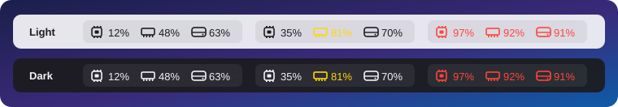
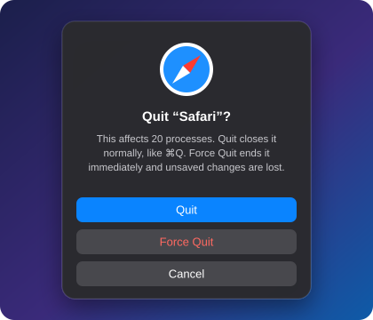
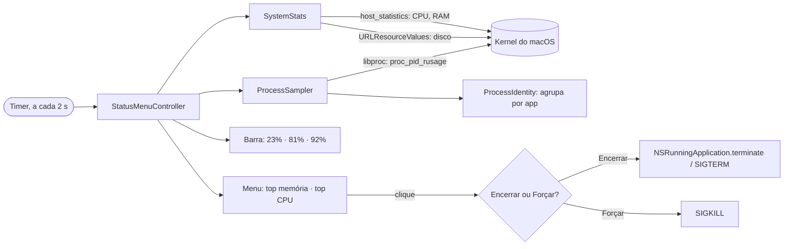

<p align="center">
  
</p>

<h1 align="center">SystemMonitor</h1>

<p align="center"><a href="README.md">English</a> · <b>Português</b></p>

<p align="center">
  CPU, RAM e disco em tempo real na barra de menus do Mac.<br>
  Nativo e leve: um app de menos de 1 MB escrito em Swift, sem dependências.
</p>

<p align="center">
  <a href="https://github.com/xfelipealves/SystemMonitor/releases/latest"></a>
  <a href="https://github.com/xfelipealves/SystemMonitor/actions/workflows/ci.yml"></a>
  
  
  
</p>

<p align="center">
  
</p>

<p align="center"><sub>As ilustrações são simuladas; seus apps e números serão outros.</sub></p>

## Recursos

- **CPU, RAM e disco na barra de menus**, atualizados a cada 2 segundos.
- **Cores de alerta:** o número fica amarelo a partir de 75% e vermelho a partir de 90%. Os ícones seguem o modo claro e o escuro.
- **Os 8 apps que mais usam memória e os 5 que mais usam CPU**, com os mesmos números do Monitor de Atividade.
- **Agrupado por app, com o ícone do app.** Processos auxiliares e páginas web somam no app que os abriu. Por exemplo, os 20 processos do Safari aparecem numa linha só, "Safari".
- **Encerrar ou Forçar Encerramento com um clique.** Encerrar fecha o app normalmente, como o ⌘Q, e ele pode pedir para salvar. Forçar fecha na hora.
- **Abrir ao iniciar o Mac**, ligado e desligado pelo menu.
- **Inglês ou português**, escolhido em **Language**.
- **Discreto:** sem ícone no Dock, cerca de 30 MB de memória e uso mínimo de CPU.

<p align="center">
  
</p>

<p align="center">
  
</p>

## Instalação

Requer macOS 14 (Sonoma) ou mais recente, em Apple Silicon ou Intel.

### Opção 1: instalador de uma linha (recomendado)

Cole no Terminal:

```sh
curl -fsSL https://raw.githubusercontent.com/xfelipealves/SystemMonitor/main/install.sh | sh
```

Ele baixa a última versão, coloca em `/Applications` e abre. Como o download é feito pelo `curl`, e não pelo navegador, o macOS abre o app sem aviso de segurança. Se quiser, [leia o script](install.sh) antes de rodar.

### Opção 2: baixar o app

1. Baixe o **SystemMonitor.zip** na [última versão](https://github.com/xfelipealves/SystemMonitor/releases/latest).
2. Descompacte e arraste o **SystemMonitor.app** para **Aplicativos**.
3. Abra. Na primeira vez, o macOS vai bloquear (veja abaixo).

### Opção 3: compilar o código

Requer as Command Line Tools do Xcode (`xcode-select --install`).

```sh
git clone https://github.com/xfelipealves/SystemMonitor.git
cd SystemMonitor
./build.sh install
```

### Por que o macOS avisa sobre o app

O SystemMonitor é gratuito e não é assinado com uma conta paga de desenvolvedor Apple. Por isso, o macOS bloqueia qualquer cópia baixada pelo navegador, com uma mensagem como *"A Apple não pôde verificar se o SystemMonitor está livre de malware"*. As opções 1 e 3 evitam isso. Se você usou a opção 2, libere uma vez por um destes caminhos:

- **Pelos Ajustes do Sistema:** abra o app uma vez e feche o aviso. Depois vá em **Ajustes do Sistema → Privacidade e Segurança**, role até o fim e clique em **Abrir Mesmo Assim** ao lado do SystemMonitor.
- **Pelo Terminal:**

  ```sh
  xattr -dr com.apple.quarantine /Applications/SystemMonitor.app
  ```

Todo o código está aqui, e cada versão é compilada a partir dele pelo [GitHub Actions](.github/workflows/release.yml).

### Desinstalar

Escolha **Sair** no menu e rode:

```sh
rm -rf /Applications/SystemMonitor.app
defaults delete com.xfelipealves.systemmonitor 2>/dev/null
```

Se você ligou o Abrir ao iniciar o Mac, desligue antes de apagar o app.

## Como funciona



| Indicador | Origem | Mesmo valor que |
|---|---|---|
| CPU | `host_statistics(HOST_CPU_LOAD_INFO)`, diferença entre duas leituras | Monitor de Atividade → CPU |
| RAM | Memória de apps + fixa + comprimida (`host_statistics64`) | Monitor de Atividade → Memória Usada |
| Disco | Volume de inicialização, espaço liberável conta como livre | Finder → Obter Informações |
| Por app | `proc_pid_rusage`: `ri_phys_footprint` e tempo de CPU | Monitor de Atividade → colunas Memória e % CPU |

**Regra de agrupamento:** um processo pertence ao `.app` mais externo no caminho dele, então os auxiliares do Chrome contam como Chrome. Um serviço XPC, como uma página web do WebKit, pertence ao app responsável por ele. O resto é agrupado pelo nome do executável.

## Estrutura

```
Sources/SystemMonitor/
├── App/
│   ├── main.swift                  inicia o app sem ícone no Dock
│   ├── AppDelegate.swift           ciclo de vida do app
│   ├── StatusMenuController.swift  item da barra, menu e timer
│   ├── Alerts.swift                janelas de encerrar e de erro
│   └── LaunchAtLogin.swift         Abrir ao iniciar o Mac (SMAppService)
├── Metrics/
│   └── SystemStats.swift           uso total de CPU, RAM e disco
├── Processes/
│   ├── LibProc.swift               funções da libproc
│   ├── ProcessIdentity.swift       a qual app cada processo pertence
│   ├── ProcessSampler.swift        memória e CPU por app
│   └── ProcessTerminator.swift     Encerrar e Forçar Encerramento
└── Support/
    ├── Formatting.swift            números, cores e títulos do menu
    └── Localization.swift          textos em inglês e português
Tests/SystemMonitorTests/           testes unitários
Resources/                          Info.plist e ícone do app
scripts/                            geradores do ícone e das ilustrações
```

## Desenvolvimento

```sh
swift build                             # build de debug
swift test                              # testes (precisa do Xcode, não só das Command Line Tools)
./build.sh                              # SystemMonitor.app universal em build/
./build.sh install                      # compila, copia para /Applications e abre
./scripts/make-icns.sh                  # regenera o ícone do app
python3 scripts/make-illustrations.py   # regenera as imagens em docs/
```

### Publicar uma nova versão

1. Atualize `CFBundleShortVersionString` no `Resources/Info.plist` e adicione uma seção no `CHANGELOG.md`.
2. Crie e envie a tag:

   ```sh
   git tag v1.2.0 && git push origin v1.2.0
   ```

O GitHub Actions roda os testes, compila o app universal e publica a versão, usando a seção do changelog como notas.

## Limitações

- Só aparecem os seus processos. Ler os de outros usuários e os do sistema (root) exige privilégios de administrador.
- Encerrar um grupo afeta todos os processos dele. Por exemplo, encerrar `node` fecha todos os processos `node` abertos.
- Se a barra de menus estiver cheia, o notch pode esconder o indicador.

## Licença

[MIT](LICENSE) © 2026 Felipe Alves
